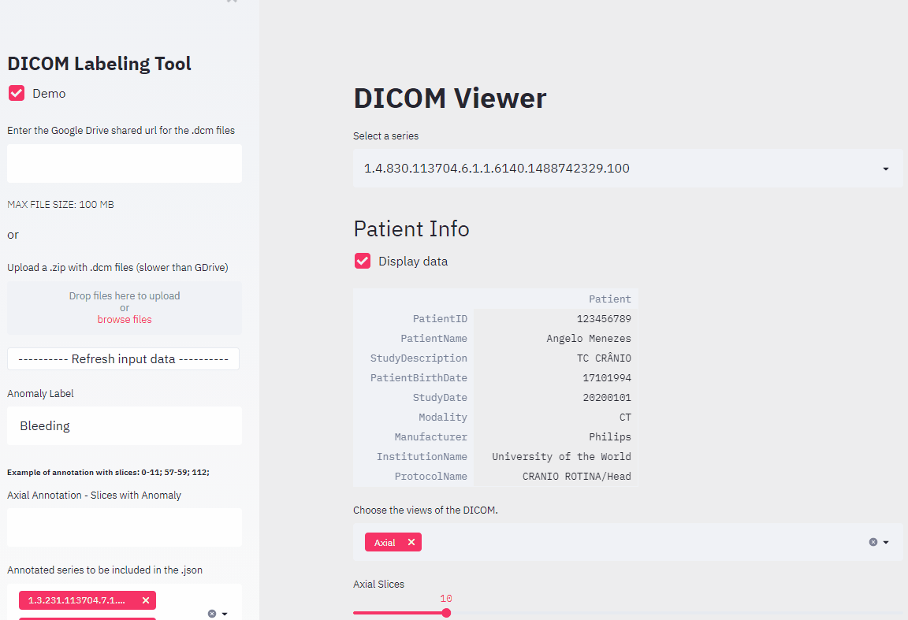

# Web-based DICOM viewer with labeling tool

This repository contains a simple web-based DICOM viewer built using Streamlit. The viewer also has a tool to annotate which slices of a specific series of dicom files have anomalies. Annotations are in .JSON format with labels "Anomaly" and "Slices" for each series. This tool was meant to be a weekend project for me to learn how to work with Streamlit, Docker and Heroku, but it took a little more than that to figure out how to set up everything and to make it look good.

[Demo hosted on ~Heroku~ Render](https://dicom-labeling-tool.onrender.com/) (Now that Heroku has canceled its free-tier)



The tool only deals with zip files that have one or more folders, normally represented as `series`, with dicom files inside. A [sample](sample/sample.zip) of an acceptable zip file can be checked inside the sample folder.
Zip files can be uploaded via public shared URLs from *Google Drive* or using the file upload widget. 

As the demo is hosted on Heroku and their free tier dyno has limited memory resources, uploaded zip files are limited to **100MB**. However, this restriction can be adjusted by code when running the web viewer locally.


# Setup
## Docker

Clone the repository and set the current directory:

```bash
git clone https://github.com/angelomenezes/dicom-labeling-tool.git
cd dicom-labeling-tool/
``` 

For running a local docker container, change the line in the Docker file from:
```docker
CMD streamlit run DICOM.py --server.port $PORT
```
to
```docker
CMD streamlit run DICOM.py --server.port 8501
```

Then, you can build and run successfully the container with:

```bash
docker build ./ --tag webapp:v1
docker container run -p 8501:8501 webapp:v1
```

To finish, open the browser at http://localhost:8501/

## Conda
Make sure you have [Anaconda](https://www.anaconda.com/) installed since it is the easiest way to setup GDCM on Python3 which is a requirement for the pydicom library.

**(Optional)** Create a conda environment for installing and running the app:

```bash
conda create --name DICOM_env python=3.6.10 -y
conda activate DICOM_env
```

Clone the repository and set the current directory:

```bash
git clone https://github.com/angelomenezes/dicom-labeling-tool.git
cd dicom-labeling-tool/webapp/

conda install -c conda-forge -y gdcm
pip install -r requirements.txt

streamlit run DICOM.py
```
To finish, open the browser at http://localhost:8501/

## License
[`MIT`](LICENSE)

## Contact
Any comments, suggestions or contributions are welcome. You can contact me at angelomenezes.eng@gmail.com.
